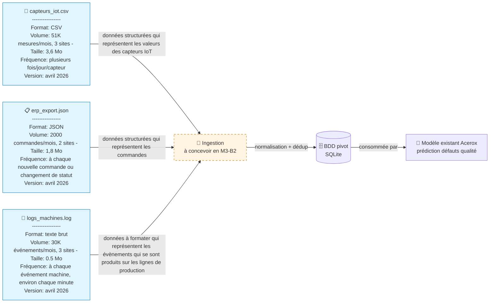

# Schéma des flux de données — Acerox Métallurgie

> Schéma Mermaid à compléter. Doit montrer :
> - **Sources** (capteurs IoT, ERP, logs, *bonus PDF*)
> - **Ingestion** (à concevoir en M3-B2)
> - **BDD pivot** (à modéliser en M3-B2)
> - **Modèle existant** Acerox (placeholder, hors-sujet ici)
>
> Légende explicite : qui produit, qui consomme, contraintes.

## Schéma

## Légende

> Reformule en 5 lignes max ce que le schéma raconte (qui produit quelle
> donnée, qui consomme, contraintes critiques).

- **Producteur** : les capteurs IoT des 3 sites (mesures), les machines industrielles (logs événements) et l'ERP sur 2 sites (commandes/statuts).
- **Consommateur final** : le modèle Acerox de prédiction des défauts qualité, via la BDD pivot SQLite alimentée par la couche d'ingestion.
- **Contraintes critiques** (fréquence / RGPD / qualité) : ingestion quasi continue qui peut représenter un volume important de données (ici on ne dispose que d'un mois de données), formatage obligatoire des logs texte brut, normalisation + déduplication avant stockage, contrôle de qualité des données et gouvernance des données opérationnelles.

## Décisions associées

- Source(s) retenues en priorité : 
    - capteurs_iot.csv
    - logs_machines.log
- Source(s) écartées : 
    - erp_export.json
- Source bonus (PDF) traitée ? oui / non, pourquoi : ...

---

*Schéma produit par Célia, 30-06-2026, dans le cadre du brief M3-B1 ATOS.*
